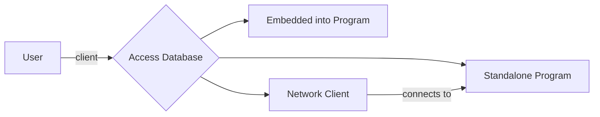
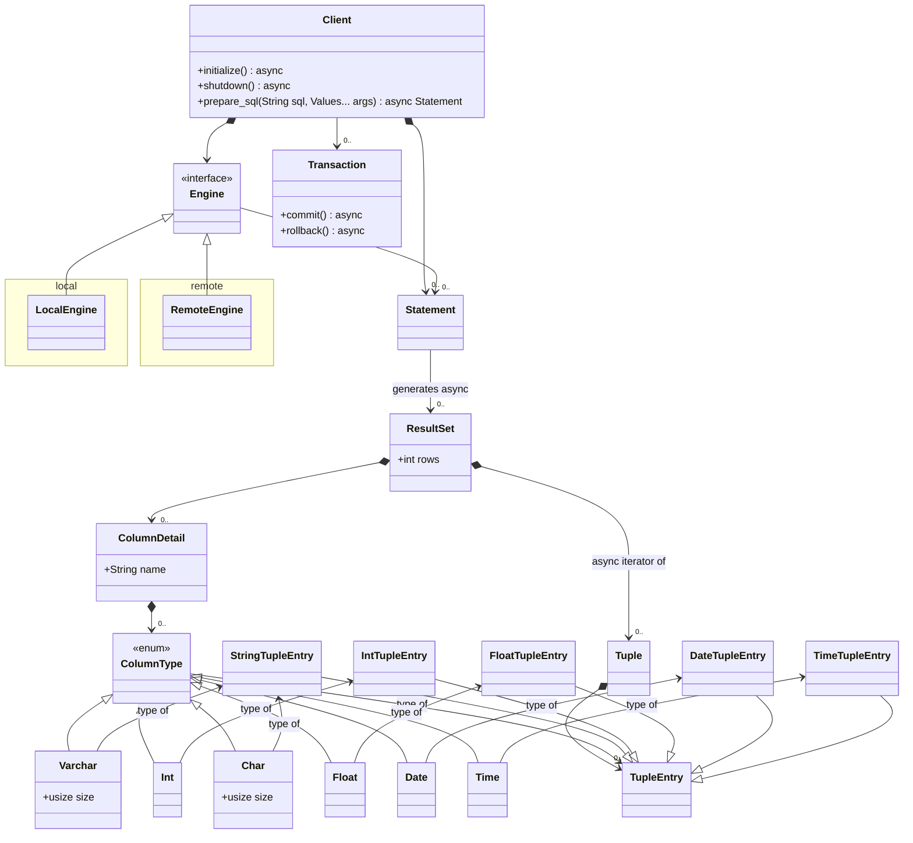

# Design of the Database

## Interaction between User and Database

The user can interact with the database as shown below:

```mermaid
flowchart LR
    User[User] --> |client| Access{Access Database}
    Access --> Embed[Embedded into Program]
    Access --> Standalone[Standalone Program]
    Access --> NetworkClient[Network Client]
    NetworkClient --> |connects to| Standalone
```

## Database Client

The database client can be modeled as follows:

```mermaid
classDiagram

    class Client {
        +initialize() async
        +shutdown() async

        +prepare_sql(String sql, Values... args) async Statement
    }

    class Engine {
        <<interface>>
    }

    namespace local {
        class LocalEngine
    }

    namespace remote {
        class RemoteEngine
    }
    
    Engine <|-- LocalEngine
    Engine <|-- RemoteEngine

    class Transaction {
        +commit() async
        +rollback() async
    }

    class Statement

    class ResultSet {
        +int rows
    }

    class ColumnDetail {
        +String name
    }

    class ColumnType {
        <<enum>>
    }

    class Tuple
    class TupleEntry

    Tuple *--> "0.." TupleEntry
    ColumnType --> TupleEntry: type of

    %% data types for the tuples
    class Char {
        +usize size
    }
    ColumnType <|-- Char
    class Varchar {
        +usize size
    }

    ColumnType <|-- Varchar
    StringTupleEntry <-- Char: type of
    StringTupleEntry <-- Varchar: type of
    StringTupleEntry --|> TupleEntry

    ColumnType <|-- Int
    IntTupleEntry <-- Int: type of
    IntTupleEntry --|> TupleEntry

    ColumnType <|-- Float
    FloatTupleEntry <-- Float: type of
    FloatTupleEntry --|> TupleEntry

    ColumnType <|-- Date
    DateTupleEntry <-- Date: type of
    DateTupleEntry --|> TupleEntry

    ColumnType <|-- Time
    TimeTupleEntry <-- Time: type of
    TimeTupleEntry --|> TupleEntry

    ColumnDetail *--> "0.." ColumnType
    ResultSet *-->  "0.." ColumnDetail
    ResultSet *--> "0.." Tuple: async iterator of

    Client *--> Engine 
    Client --> "0.." Transaction
    Client *--> "0.." Statement
    Statement --> "0.." ResultSet: generates async
    Engine --> "0.." Statement
```

